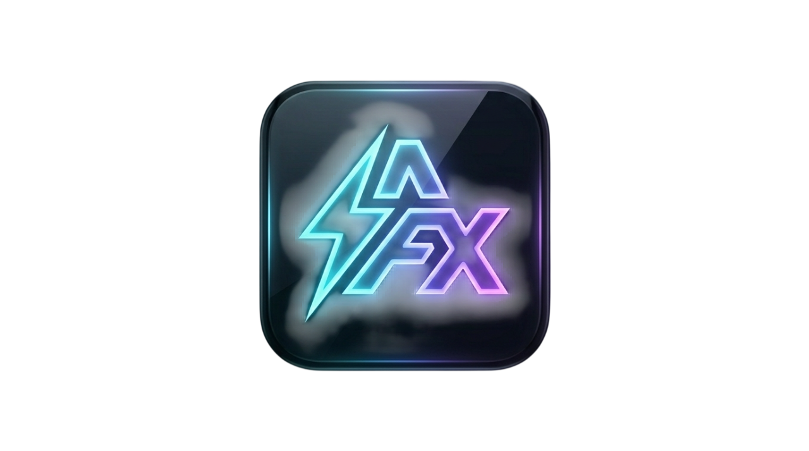

# Aether FX Optimizer

Aether FX Optimizer is a desktop control room for Adobe After Effects. It combines Tauri, SvelteKit, and Bun to give editors, motion designers, and pipeline engineers a single place to:

- inventory every detected After Effects install, runtime profile, and cache folder;
- surface plugin health, GPU/CPU preferences, power settings, and startup noise;
- keep `.aep` / `.aepx` / `.aet` projects discoverable with an Everything-backed index;
- mute noisy background services with a session mode that re-enables them after the work is done.

Everything works together to keep After Effects fast and repeatable across machines.

## Core capability highlights

1. **After Effects polyglot panel** – every discovered install shows its executable, version, cache/profile paths, and per-run performance mode switches (balanced, GPU priority, or CPU priority).
2. **Plugin health cockpit** – filters for unsigned binaries and duplicates, plus grouping by `version`, `common`, or `user` MediaCore roots so you can collapse noise and zoom into risky files.
3. **Everything-aware project index** – detects es.exe on `PATH`, falls back to a filesystem walker, and gives you quick/full scans that list top `.aep/.aepx/.aet` files with drive, size, and timestamps.
4. **Session mute mode** – scored startup items can be disabled in batch and automatically restored once work is done, keeping the CPU from being poked by background helpers.
5. **Startup noise scanner** – ranked list of high-score entries with inline disable controls so you can prune the most disruptive helpers without leaving the UI.
6. **Cache & profile hygiene** – hero controls let you purge every detected RAM/disk cache or reset specific installs without hunting folders manually.
7. **Power & GPU tuning** – set the Windows processor cap (stable vs performance), choose a GPU boost preference, and have the UI remind you when Everything could power the scan faster.

## Prerequisites

- [Bun](https://bun.sh) v1+ on your path (the repo uses Bun scripts for every lifecycle command).
- Rust stable with the `cargo` toolchain (Tauri builds the bundled desktop binary).
- Tauri CLI (`bun run tauri` wraps every Rust invocation).
- Optional: [Everything](https://www.voidtools.com/downloads/) for instant system-wide project indexing. The app displays whether `es.exe` was found and exposes a download link.

## Getting started

```bash
bun install
# Use the local config if bun is not in your global path
bun run tauri:local dev
```

1. Open `http://localhost:1420` after the dev server starts.
2. Refresh the central scan page to see system overviews, plugin/group summaries, and the startup noise board.
3. Use the session mode buttons, plugin filters, and performance toggles that are now wired into the backend commands (e.g., `get_everything_status`, `set_performance_mode`).

## Building for release

```bash
bun run check
bun run tauri build
```

The bundled artifacts appear under `src-tauri/target/release/bundle`. Use the release workflow described below to publish GitHub releases automatically.

## GitHub release automation

A dedicated workflow (`.github/workflows/release.yml`) runs whenever you push a `v*` tag. It:

1. Sets up Bun, Rust, and required Linux dependencies (`libwebkit2gtk`, `pkg-config`, `libssl`, `libgtk-3`).
2. Runs `bun install`, `bun run check`, and `bun run tauri build`.
3. Zips every file in `src-tauri/target/release/bundle` into `build/ae-tools-app-${{ github.run_number }}.zip`.
4. Uses `softprops/action-gh-release` to publish the zipped artifact to the new release.

Tag `v1.0.0`, `v1.0.1`, etc., and the workflow will recreate release assets for you.

## Additional tips

- Use the Everything status card to confirm `es.exe` is discoverable before running a full project scan.
- Expand a plugin group to see source-specific counts and reduce jitter by collapsing sections you don’t care about.
- The session panel remembers what it muted so you can always restore the same list in one click.
- Keep the hero action bar handy for power-cap toggles and workspace-wide cache cleanup, especially before sending renders to After Effects.
- The Everything status card now ships its own “Auto install Everything” controls — pick x86/x64 installers or portable ZIPs and the app will download, open, and (when possible) launch them inside `%TEMP%`.
 
## Marketing assets



<video controls loop muted width="640" height="360">
  <source src="./static/product-banner.mp4" type="video/mp4" />
  Your browser does not support the video tag.
</video>

Use the same 16:9 hero footage and neon gradient mark to highlight how the tool brings Everything indexing, session mode, GPU tuning, and cache hygiene into one dashboard.

## Branded icon + launcher assets

If you want the shipped desktop window, taskbar shortcut, and OS dock to show the new Aether FX logo, drop your master PNG into `static/aetherfx-logo.png` and then regenerate the Tauri icon set inside `src-tauri/icons/`. On macOS/Linux you need full-resolution PNG variants (`32`, `128`, `icon.png`, `icon.icns`, `icon.ico`). On Windows you can use a tool like ImageMagick or `icotool` to downscale/encode `icon.ico`. For example:

```bash
cp static/aetherfx-logo.png src-tauri/icons/32x32.png
cp static/aetherfx-logo.png src-tauri/icons/128x128.png
# regenerate icon.icns/icon.ico with iconutil / imagemagick ...
```

Once those files contain your custom logo, the next `bun run tauri build` or CI release run will embed it in the title bar, taskbar, and installer.

## Feedback & contributions

Improve the backend commands in `src-tauri/src` or the Svelte components in `src/lib/components` and run `bun run check` to stay aligned with the project conventions.
